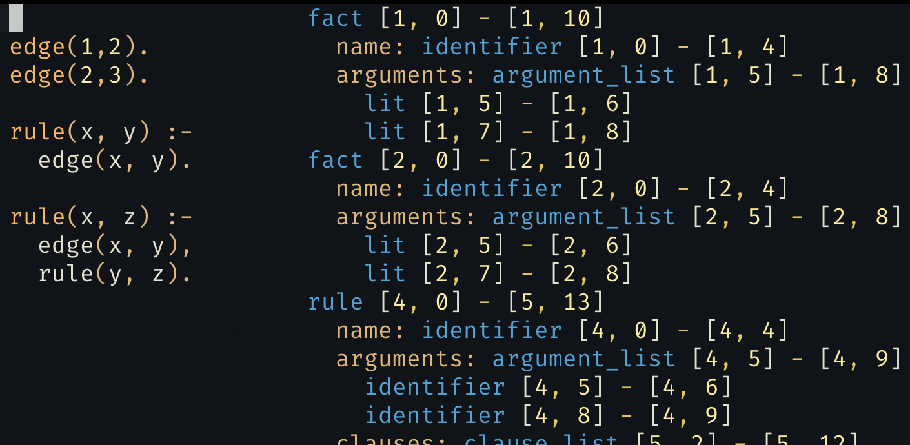

# tree-sitter-eclair

A tree-sitter grammar for
[eclair](https://github.com/luc-tielen/eclair-lang).

Here's what it looks like when used inside Neovim:



## Installation

Currently this is only tested with Neovim (0.5), using nvim-treesitter library.

First, run the following commands in a shell:

```bash
$ git clone git@github.com:luc-tielen/tree-sitter-eclair.git && cd tree-sitter-eclair
$ npm install
$ ./node_modules/tree-sitter-cli/tree-sitter generate
$ ./node_modules/tree-sitter-cli/tree-sitter test
$ cp -r queries/ .local/share/nvim/site/pack/packer/start/nvim-treesitter/queries/eclair/
```

Then, open neovim and in normal mode type the following:

```
:TSInstall eclair
```

Finally, we need to add filetype detection support for Eclair.
Add the following to init.vim:

```viml
au BufNewFile,BufRead *.eclair set filetype=eclair
```
